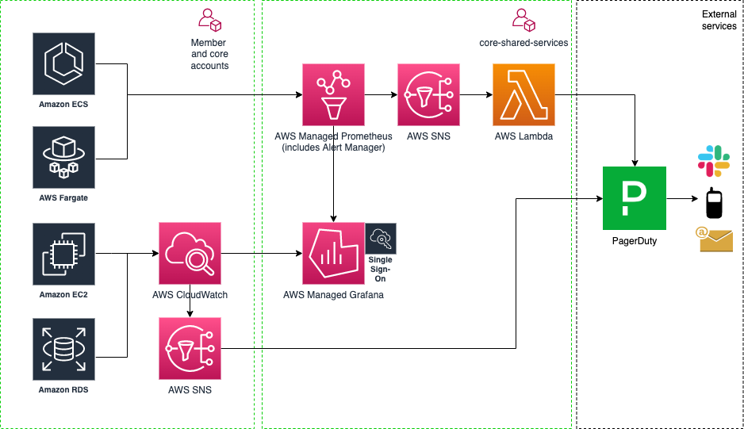

# 17. Monitoring and Alerting

Date: 2021-12-08

## Status

✅ Accepted

## Context

We need to monitor the Modernisation Platform infrastructure. This breaks down into the following areas:

- core platform security baseline Cloudwatch alarms set up for GuardDuty, SecurityHub and Config
- member account security baseline Cloudwatch alarms set up for GuardDuty, SecurityHub and Config
- core platform additional alarms that we may want to config
- member additional alarms that they may want to configure
- metrics and alarms for ECS/Fargate
- visualisation of metrics for the core platform
- visualisation of metrics for member accounts
- how do we get alerts

We have talked with the Cloud Platform team, there is currently limited capacity and adding additional metrics to their Prometheus stack is not a good option.  We have also discussed this with Operations Engineering who will be looking into centralised monitoring, but this work has not been started yet - <https://github.com/ministryofjustice/operations-engineering/issues/147>.

With this in mine, the Modernisation Platform will start to develop it's own solution, aligning technology choices with the other platform teams where possible.

## Decision

### Visualisation

The main visualisation tool in use across the MoJ is [Grafana](https://grafana.com/), this would be the most logical tool choice, with AWS managed being the preferred way of hosting. At the time of writing there is currently no Terraform provider, although this is on the AWS provider backlog.

The Modernisation do not currently have any metrics that we want to view with Grafana, and we currently have no users that have expressed a desire to use Grafana.

Decision:

Wait until we have a solid use case for visualising metrics, then re-evaluate at the time the right visualisation tool.

### Core Platform security baseline alarms

We have a number of Cloudwatch alarms set up for GuardDuty, SecurityHub and Config.

Decision:

We want to be alerted to these.

### Member account security baseline alarms

We have a number of Cloudwatch alarms set up for GuardDuty, SecurityHub and Config.

Decision:

We want to be alerted to these.

### Core Platform additional alarms

We do not currently have any additional alarms configured, but we know there are some we would like to implement, such as notification if an account becomes detached from the Transit Gateway.

Decision:

The solution should support the ability to add additional alarms.

### Member account additional alarms

We would like to be able to offer users easy to use out of the box alerting. We do not yet know what users want or what this could look like.

Decision:

We will not be doing this at this time. This will be covered in - <https://github.com/ministryofjustice/modernisation-platform/issues/1332>.

### Metrics and Alarms for ECS/Fargate applications

We have applications that use ECS and will possibly have more, we could follow Cloud Platform and use a Prometheus/Alert manager stack for these. We would most likely use AWS managed Prometheus. There is however currently no user demand for this.

Decision:

We will not be doing this at this time. When we have a solid user need then re-evaluate what is the right tool.

### Receiving alerts

Other platform teams use [PagerDuty](https://moj-digital-tools.pagerduty.com/) and [Slack](https://slack.com/). These tools are know in the organisation, used by other platform teams and fulfil our needs.

Decision:

- We will create a Modernisation Platform team in PagerDuty and add our permanent staff to our team. <https://github.com/ministryofjustice/modernisation-platform/issues/1312>
- We will integrate Slack with PagerDuty to push our alarms to Slack. <https://github.com/ministryofjustice/modernisation-platform/issues/1312>
- We will integrate our existing alarms that we want to monitor with PagerDuty. <https://github.com/ministryofjustice/modernisation-platform/issues/1334> and <https://github.com/ministryofjustice/modernisation-platform/issues/1335>
- We will not yet consider an on-call rota, this will be decided here - <https://github.com/ministryofjustice/modernisation-platform/issues/1333>.

## Consequences

We will currently focus on getting our existing alarms integrated with PagerDuty and Slack.
Longer term our monitoring architecture may look like this, but currently we are only building out the PagerDuty integration.

